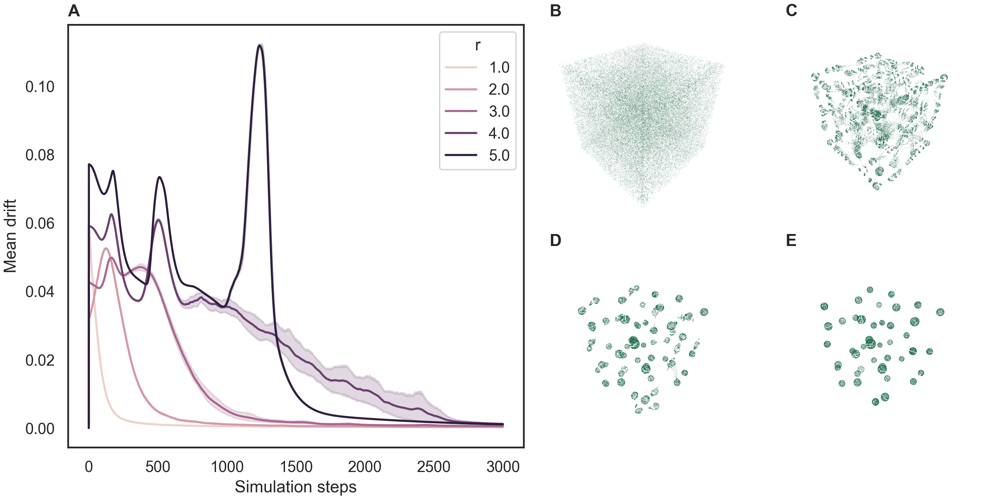

# FLAMEGPU2 Circles Benchmark

This repository contains visualisation of a [FLAME GPU 2](https://github.com/FLAMEGPU/FLAMEGPU2) implementation of the Circles agent based model at various population scales and densities.

Extensive benchmarking of the same model is conducted in [https://github.com/FLAMEGPU/FLAMEGPU2-circles-benchmark](https://github.com/FLAMEGPU/FLAMEGPU2-circles-benchmark)

## Benchmark Description and Results

There is a single experiment within this example which mean measures drift of the agents per time step. This gives an indication of population stability and convergence towards a stable state. The communication radius is varied to show how this effects the emergent behaviour of the populations.

If the example is built with the CMAKE `VISUALISATION` flag then the experiment runs a single experimental configuration with a fixed communication radius.

An example visualisation can be viewed on YouTube. 

[](https://www.youtube.com/watch?v=ZedroqmOaHU)

The is an example of raw data in the [`sample/data`](sample/data) directory with a description of the machine configurations used to generate it in each directory.

The results below are from a RTX 2080 Ti.

### Drift Experiment

+ Communication Radius is varied between `1.0` and `5.0` with a  step of `1.0`
+ Population size is fixed at 64,000
+ Environment width is fixed at 40.0f
+ The number of simulation steps is 3000
+ 10 iterations are completed with unique seeds
 
[](sample/figures/2080Ti-11.4-471.41/alpha.2-2080Ti-11.4-beltsoff/figure.png)

## Building and Running the Benchmark

Detail of dependencies and the `cmake` build process are described in full in the [FLAMEGPU2-example-template Repo](https://github.com/FLAMEGPU/FLAMEGPU2-example-template) and are not repeated here. The benchmark should be built with seatbelts off (e.g. `-DSEATBELTS=OFF` passed to the `cmake` configuration step) to disable additional run-time checks and optionally disabling Python Swig support which is not needed for this model(-DBUILD_SWIG_PYTHON=OFF ). E.g. for Volta (`SM_70`) GPUs under Linux.

```bash
# Configure 
cmake . -B build -DCMAKE_BUILD_TYPE=Release -DSEATBELTS=OFF -DBUILD_SWIG_PYTHON=OFF -DCUDA_ARCH=70
# Build
cmake --build build -j`nproc` 
```

### Execution and Data generation

```bash
cd build
./bin/Release/circles-benchmarking-vis
```
This will produce a number of `.csv` files in the `build` directory.

Note: The `FLAMEGPU2_INC_DIR` environment variable may need to be set to `./_deps/flamegpu2-src/include/` for run-time compilation (RTC) to succeed if the source directory is not automatically found.


## Plotting Results

Figures can be generated from data in CSV files via a python script.

### Dependencies

It is recommended to use python virtual environment or conda environment for plotting dependencies.

I.e. for Linux to install the dependencies into a python3 virtual environment and plot the results from all experiments output to the `build` directory.

```bash
# From the root of the repository
# Create the venv
python3 -m venv .venv
# Activate the venv
source .venv/bin/activate
# Install the dependencies via pip
python3 -m pip install -Ur requirements.txt
# Plot using csv files contained within the build directory
python3 plot.py build -o build/figures
# Use -h / --help for more information on optional plotting script parameters.
```

The sample figures were generated from the root directory using

```bash
python3 plot.py -i sample/data/2080Ti-11.4-471.41/alpha.2-2080Ti-11.4-beltsoff -o sample/figures/2080Ti-11.4-471.41/alpha.2-2080Ti-11.4-beltsoff
```
